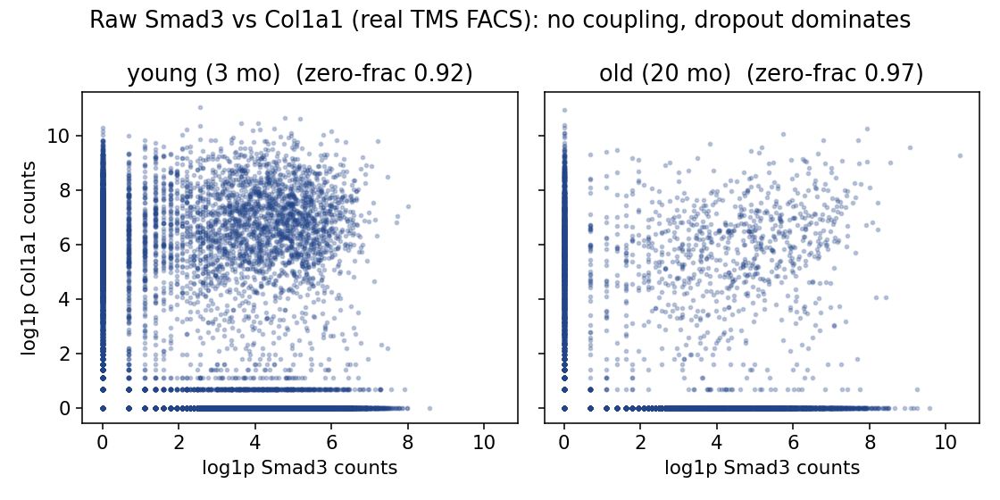

# Metric autopsy: a metric-agnostic gate system for separating biological signal from QC and technical artifacts in single-cell metrics

**Theodor Spiro**

Vaika Inc. · ORCID [0009-0004-5382-9346](https://orcid.org/0009-0004-5382-9346) · tspiro@vaika.org · GitHub [@mool32](https://github.com/mool32)

*Preprint. Software: `metric-autopsy` (MIT). Version 0.1.1.*

---

## Abstract

Single-cell analyses routinely follow a "compute then believe" default: a scalar metric is calculated, it differs between conditions, and the difference is reported as biology. But a metric can move because of dropout, library size, a batch effect, a factorial-interaction confound, or plain mathematics — with no change in the biological quantity of interest. This tendency is not hypothetical: three of my own analyses each survived weeks of work before a short quality-control (QC) check invalidated them — in one case a 45-second QC check invalidated three weeks of downstream work. I present `metric-autopsy`, a metric-agnostic gate system that inverts the default from "compute then believe" to "state your commitments, red-team, then believe." The user supplies a metric as a black-box callable and the names of factorial `obs` columns; the harness probes the *data* and the *metric's response to controlled perturbations of the data* through eight gates (GATE 0–7). Six gates run automatically from the data — mathematical independence, factorial QC parity, n_genes matching, raw-data visibility, stratified controls, and cross-dataset replication (the last only when a second dataset is supplied) — and two are judgment gates the accompanying skill elicits rather than scripts. Because the automatic perturbations are single-cell-specific (dropout, depth, library size), the tool is metric-agnostic but domain-locked to scRNA-seq QC. I describe each gate faithful to the implementation, and demonstrate the workflow on a synthetic confound patterned on a mutual-information "coupling loss" driven by a sex-by-age detection artifact that was recorded, by hand, in an internal validation checklist; I then run the same autopsy on the real Tabula Muris Senis FACS data (110,824 Smart-seq2 cells), where the metric reaches the same verdict — death at GATE 0, confounded by a sex-by-age detection artifact rather than measuring biology. The tool ships as a Claude Code skill and a pip package, and was itself subjected to an adversarial code audit (24 findings fixed). The gates are necessary, not sufficient: no correlation metric is fully depth-invariant under dropout.

---

## 1. Introduction: the "compute then believe" failure mode

The workflow that produces most single-cell "findings" is short. You write down a metric — a mutual information, a correlation, an entropy, an eigenvalue ratio — compute it on group A and group B, the two numbers differ, and you write a sentence about biology. The metric did the believing for you. Nothing in this pipeline asks whether the metric *could have moved for a non-biological reason*, and by the time that question is asked (if it ever is), the interpretation is already load-bearing in a manuscript.

This tool exists because that failure mode is not abstract to me. Three analyses I ran each looked like a discovery and each was, on inspection, an artifact. They are worth stating with their real numbers, because the gate system is an attempt to institutionalize the checks that would have caught each one early.

**Error 1 — mathematical dependency (ACP).** The claim was that intracellular entropy (E_intra) and intercellular entropy (E_inter) are anticorrelated during aging, rho = -0.54. The problem is that when cells become internally more uniform (low E_intra) they also become more similar to one another (low E_inter). That is a structural tendency of two metrics computed from the same matrix, not necessarily biology. The tell: the signal vanished on 10x data (rho = -0.09) and *reversed sign* at low sequencing depth (rho = +0.38 at 500 genes). The "biological finding" was inseparable from the measurement platform.

**Error 2 — a physical constant masquerading as biology (beta-heart).** The claim was that the spectral exponent beta of the ECG encodes cardiac health and aging. In fact beta primarily reflects the geometry of the cardiac conduction system and the conductance properties of the tissue — a biophysical constant of the medium, like measuring the speed of sound in bone and calling it a health metric. The 12-lead beta-vector reconstructs anatomy (AUC = 0.98 for LBBB vs RBBB), consistent with beta tracking the conduction geometry itself rather than a separate biological process. This example is not single-cell, but it is the cleanest instance of the general failure the tool targets — a metric that faithfully measures the *medium* and is read as the *biology* — and it is exactly the class of confound that GATE 4 (a judgment gate) exists to surface; the single-cell analog is a metric that tracks a fixed property of the assay rather than the cell state.

**Error 3 — a technical confound (MI coupling).** The claim was that SMAD-pathway mutual information declines specifically with aging while housekeeping coupling is preserved. The reality: male old cells in Tabula Muris Senis FACS detect 2.4x fewer genes than male young cells (median 3670 vs 1540 — a difference far outside sampling noise, but that says nothing about whether its origin is biological or technical), while female cells are stable (female young 2742, female old 2843). Mutual information computed with a zero/low/high discretization uses "not detected" as a category, so it is driven directly by detection rate. The apparent "pathway-specific coupling loss" was three things at once: males pulling MI down through QC, females stabilizing the housekeeping signal, and the pooled comparison manufacturing an illusion of specificity. The confound lived in the sex-by-age *interaction* — invisible in the marginal young-vs-old comparison. Only male-old was degraded. Pooling hid it completely. I spent roughly three weeks and 500+ lines of code on 23 robustness tests before checking QC; the QC check took 45 seconds and invalidated most of the work.

The common lesson across all three is a single inversion. The default pipeline is *compute then believe*. What each failure needed was *state your commitments, red-team, then believe*: write down, before looking at any outcome, what the metric is supposed to measure and what would disprove the claim; then subject it to the specific attacks that killed its predecessors. `metric-autopsy` turns that inversion into runnable behavior.

The design commitment is deliberately narrow. The gates are **metric-agnostic**: you pass a callable `metric(data) -> float` and the names of your factorial `obs` columns, and the gates treat the metric as a black box, probing the data and the metric's *response to controlled perturbations of the data*. The harness knows single-cell QC; it does not know your metric. This keeps the tool focused on the one domain where the failures were concrete (single-cell RNA-seq QC): it accepts any metric a user brings, but the perturbations it applies (dropout, depth, library scaling) are single-cell-specific and meaningless for a non-scRNA metric. The tool is metric-agnostic, not domain-agnostic.

**Relation to existing tooling.** Established single-cell QC packages — scran (Lun et al., 2016), scater (McCarthy et al., 2017), and probabilistic cell-quality filters such as miQC (Hippen et al., 2021) — score and filter *cells* on quality; batch-integration methods correct *cell embeddings*, and their tendency to over- or under-correct is itself an active benchmarking problem (Leek et al., 2010; Luecken et al., 2022). A parallel line of work confronts false discoveries that arise from the *analysis* rather than the data: pseudoreplication in single-cell differential expression (Squair et al., 2021) and "double dipping" — testing for the same structure used to define the clusters (Neufeld et al., 2024) — each produce statistically compelling results with no underlying biology; the field's open methodological challenges are catalogued by Lähnemann et al. (2020). None of these asks the specific question here: whether a *downstream scalar metric* moves for a QC reason. That gap is what this tool targets. The confounds it encodes are well known individually — the depth-dependence of correlation and information metrics under dropout, library-size normalization artifacts, and interaction confounds of the Simpson's-paradox kind that pooling hides — but the contribution is not a new statistic; it is a runnable, metric-agnostic red-teaming sequence that forces those known checks to be applied, in order, before a metric is believed.

---

## 2. Methods: the gate system

Before a computed metric may be believed to reveal a biological signal, it must survive eight gates (GATE 0–7) **in order**. A failure at any gate means STOP and fix before proceeding — a downstream gate cannot rescue an upstream failure. Each gate exists because a real analysis died on it. Six gates run automatically from the data (GATE 0, 1, 2, 3, 5, 6; GATE 6 only when a second dataset is supplied), and GATE 4 and GATE 7 are judgment gates the skill elicits, because they are not computable from data alone. GATE 3 additionally returns a JUDGMENT verdict — the engine exports the numbers but you make the call — so "automatic" here means *the engine runs without you*, not *the engine decides for you*. The implementation lives in `src/metric_autopsy/` (`gates.py`, `qc.py`, `metrics.py`); the descriptions below follow that code, and the default parameters quoted are the code defaults.

The eight gates at a glance:

| Gate | Name | Kind | Confound it catches |
|---|---|---|---|
| 0 | Mathematical independence | auto | metric expectation moves with a nuisance statistic (sparsity, variance, library size) |
| 1 | QC parity across strata | auto | groups differ in technical quality in some factorial stratum |
| 2 | n_genes matching | auto | effect vanishes, is absent, or runs away once quality is equalized |
| 3 | Raw-data visibility | auto export + judgment | "shape change" that is really dropout on the zero axes |
| 4 | Metric measures what you think | judgment | metric could move for a non-biological reason (physical constant, batch, composition) |
| 5 | Controls behave in all strata | auto | positive control fails to fire or negative control fires, in some stratum |
| 6 | Cross-dataset replication | auto (2nd dataset) | platform-specific artifact that does not replicate after QC matching |
| 7 | Effect size is meaningful | judgment | statistically real but biologically negligible effect |

### GATE 0 — Mathematical independence (auto)

**What it catches.** A metric whose expectation moves when a nuisance summary statistic changes (mean, variance, sparsity, library size, dimensionality, n) even though the biology does not.

**How it is computed.** The engine perturbs the *user's own data* (it does not synthesize a separate null dataset), in three steps. (a) It builds a **bootstrap baseline**: it resamples cells with replacement and evaluates the metric `n_baseline` (default 60) times to characterize the metric's own sampling mean and spread. Resampling holds the empirical cell distribution fixed, so this baseline is meant to approximate estimator noise with the biology intact — but see the limitation below, because for finite-sample-biased estimators (notably plug-in MI) resampling with replacement introduces ties and can itself shift the estimate. (b) It applies each nuisance perturbation `n_perturb` (default 20) times to the same data and re-evaluates: `extra_dropout` (zero out 20% of the nonzero entries), `depth_downsample` (binomial thinning of counts, or per-cell scaling for non-count input), `library_scale` (per-cell multiplicative library factors), and — for whole-matrix metrics, auto-enabled when the metric has no bound gene pair — `gene_subsample`. Genes the metric is bound to are protected from gene-subsampling. (An earlier `variance_inflation` perturbation was removed after it was measured to shift the correlation-based whole-matrix reference metric by 0.0% — a scale-invariant no-op, i.e. exactly the kind of false probe this tool exists to catch, here caught in the tool itself.) (c) It compares each perturbed set to the baseline on two independent criteria. A nuisance is flagged as confounding only if the perturbed mean is *both* (i) meaningfully large relative to the metric's scale — relative change > `tol`, default 0.25, with the denominator floored so a near-zero baseline does not explode — *and* (ii) statistically separated from the baseline, z > `z_thresh`, default 4.0, where z is the mean shift divided by the standard error of the difference of the two means.

Both criteria are needed because they measure different things. The relative-change criterion (`tol`) is the **effect-size gate** — it is what says the shift is large. The z criterion is only a **separation statistic**: it grows with the number of replicates (`n_baseline`, `n_perturb`) and shrinks estimator noise, so a large z means "reliably nonzero," not "large." A z of 44.8 therefore does not, on its own, indicate a big confound; the relative change beside it does. The AND-rule exists so that a shift can be reliably nonzero (high z) yet still pass because it is small (low relative change), which is exactly the reference metric's behavior below. This is a heuristic screen, not a test calibrated to a target false-positive rate, and it applies no correction for the many perturbations and strata tested across the gate suite (see Limitations).

**Pass criterion.** The metric's expectation is stable under every nuisance perturbation (no shift beyond estimator noise), OR you ship an explicit correction for every statistic it responds to. GATE 0 is where ACP's entropy metric dies (a function of variance structure) and where `mi_3bin`'s zero-bin sparsity dependence surfaces.

### GATE 1 — QC parity across all factorial combinations (auto)

**What it catches.** Groups being compared that differ in technical quality — in *any* stratification you will use, not just the primary axis. This is the gate that kills the most work for the least effort, and the one the MI-coupling failure needed.

**How it is computed.** For every combination of the `within` factors you name (`age × sex × batch × tissue × cell_type`, as available), the engine compares the two groups on per-cell QC: `n_genes_by_counts`, `total_counts`, and mito/ribo fractions where identifiable from `var_names`. Two criteria are checked per stratum. First, the **ratio** of median n_genes between the groups; a stratum is flagged if it exceeds `thresh` (default 1.5x) in either direction. Second, the **distributional overlap** of the two n_genes distributions. Let `[a_lo, a_hi]` and `[b_lo, b_hi]` be the two groups' 10th-90th-percentile ranges; overlap is `max(0, min(a_hi, b_hi) - max(a_lo, b_lo)) / min(a_hi - a_lo, b_hi - b_lo)`, i.e. the shared span as a fraction of the narrower group's span, clipped to `[0, 1]`. This asks GATE 1's actual question — is there a common n_genes band containing cells from both groups, so they *could* be matched — rather than being a symmetric distance. At the degenerate boundaries it is defined explicitly: disjoint 10-90 ranges score 0.0; a zero-width (peaked) group sitting inside the other's range scores 1.0; two coincident points score 1.0. A stratum is flagged if overlap falls below `overlap_min` (default 0.2). This is a coarser, cheaper screen than the median-ratio balance check GATE 2 applies to the *matched* subset (median n_genes within `balance_ratio`, default 1.1x); GATE 1 asks whether matching is possible at all, GATE 2 whether the matched subset is actually balanced. Each flag records *which* criterion tripped, so the gate reports the true cause. If no stratum contains both groups, the gate returns STOP: the groups are confounded with the stratifier and cannot be compared.

**Pass criterion.** All compared factorial pairs are within `thresh` QC ratio and overlap, OR you restrict every metric computation to QC-matched subsets (GATE 2). This is the highest-yield gate: it is the check that would have caught the MI-coupling interaction confound (Error 3) in seconds.

### GATE 2 — n_genes matching preserves the signal (auto)

**What it catches.** An effect that vanishes once cell quality is equalized (a QC artifact), groups that cannot be matched at all (incomparable), OR an effect that runs away under matching (selection on the quality axis).

**How it is computed.** The engine finds the overlapping n_genes range (10th-90th percentile) between the two groups, keeps only cells inside it, and recomputes the metric on that matched subset through your callable, comparing to the unmatched effect (`metric(A) - metric(B)`). Guards apply in order. First, if the groups' n_genes ranges do not overlap at all, the gate returns STOP: the groups are incomparable. (In the real MI case, male young vs old had *3 cells* in the overlap.) Otherwise: (a) a **permutation-null floor** — if the unmatched `|effect|` is below the 95th percentile of `|effect|` under shuffled group labels, there is nothing to preserve, and the gate passes with that explicit note rather than claiming a survived signal. This is a one-sided screen on a magnitude, a heuristic for "is there any effect to test," not a calibrated significance test; an effect just above the floor by chance is treated as real and passed to guard (b). (b) If there is an effect, the matched effect must keep its sign *and* retain between `keep_frac` (default 50%) and `max_frac` (default 300%) of the unmatched magnitude — a sign flip, a collapse below 50%, *or* a runaway above 300% all fail. (c) The retained subset must actually be **balanced** (median n_genes within `balance_ratio`, default 1.1x), else the QC confound was not removed.

**Pass criterion.** The signal survives matching keeping its sign and retaining between 50% and 300% of the original effect size on a balanced matched subset (`keep_frac` to `max_frac`); or the pre-matching effect was below the null floor (no effect to begin with). Collapse below 50%, runaway above 300%, sign flip, residual imbalance, or non-overlapping ranges all fail or stop.

### GATE 3 — Visible in the raw data (auto export + judgment)

**What it catches.** An "effect" that is not actually visible in the raw values — in particular, a between-group "shape change" that is really dropout piling points onto the zero axes.

**How it is computed.** For a pairwise metric the engine exports the raw scatter of the two input genes per group (and can save a PNG), together with the fraction of points on the zero axes per group. It auto-hints when the two groups differ mostly in that zero-fraction (gap > 0.15): a "shape change" under those conditions is dropout-driven. The gate returns a JUDGMENT status: it hands you the numbers to eyeball rather than deciding for you. Stratify by sex and color by n_genes; if the "coupling" follows the quality gradient, it is a QC artifact.

**Pass criterion.** The effect is visible in the raw scatter — after stratifying by sex and coloring by n_genes — without needing the metric to surface it. (In the real analysis, MI was computed for months before anyone made the scatter; when we finally looked, the coupling was not there.)

### GATE 4 — The metric measures what you think (judgment; the skill asks)

**What it catches.** A metric that could move for more than one reason, only one of which is the biology you claim. This is where beta-heart dies: a metric that perfectly tracks a physical or geometric property is *measuring that property*.

**How it is elicited.** This gate is not computable from data alone. The skill walks you through enumerating every scenario that could move the metric — real effect, detection-rate shift, mean-expression shift, variance change, sample-size change, batch effect, composition shift (Simpson's paradox) — and deciding which your result is consistent with. If more than one row fits, you owe a test that separates them. `report.autopsy` records your answer.

**Pass criterion.** You can rule out every non-biological scenario, or you state the ambiguity explicitly in the paper.

### GATE 5 — Controls behave in all strata (auto)

**What it catches.** A positive control that fails to fire, or a negative control that does fire — in any factorial stratum. A control that "passes" only after averaging over a confound is worthless.

**How it is computed.** The engine runs your pair-metric on a positive-control pair (housekeeping, `Actb`-`Gapdh`, should always couple) and a negative-control pair (random, should not), **per stratum**. The null band is **anchored to the positive control's magnitude**, not to the negative control's own value — the negative control's value is the very quantity under test, so it cannot define its own threshold. Concretely, the band is set once from the *pooled* positive control: `neg_max = 0.2 * |pooled positive| + 1e-6` and `pos_min = neg_max`. In every stratum the negative must fall below `neg_max` and the positive must clear `pos_min`. Because the band is pooled, a stratum in which the *positive* control has itself degraded (which the checklist reports happening — housekeeping coupling declined in males) fails on the positive-control arm (`|pos| < pos_min`): the gate flags the stratum, it does not silently pass or mistake the degraded positive for a coupled negative. Magnitudes are used so signed metrics with strong negative-going controls still pass. Strata below `min_cells` are skipped.

**Pass criterion.** Positive control positive, negative control null, in all strata. (In the real analysis, the housekeeping control looked stable pooled but declined in males once stratified — confounded the same way as the test.)

### GATE 6 — Cross-platform / cross-species replication (auto if a second dataset is supplied)

**What it catches.** A platform-specific artifact (SmartSeq2 dropout, 10x UMI saturation) that mimics biology but does not replicate on independent data after QC matching.

**How it is computed.** When you pass a second `data` object, the engine re-runs GATE 1 (QC parity, stratified by the same `within` factors) and GATE 2 (n_genes matching) on it; replication is recorded as PASS only if QC parity does not stop or fail on the independent data — a confound there would make the "replication" itself a QC artifact — *and* the matched effect passes GATE 2. Running GATE 1 stratified on the replication set means an interaction confound is not hidden by pooling, the same trap that motivated the tool. Without a second dataset the gate returns SKIP.

**Pass criterion.** The effect replicates on at least one independent dataset after QC matching. Note the weakness of this bar: "one independent dataset" does not control for a *shared-platform* artifact — two SmartSeq2 datasets would "replicate" a SmartSeq2 dropout signature. Genuine cross-platform replication is what defeats platform artifacts, and the gate does not enforce it; the user must choose a second dataset on a different platform. (In the prior internal analysis recorded in ref 1: mouse TMS on SmartSeq2 showed coupling loss; human skin on 10x showed it unmatched, but n_genes-matched it vanished even in the young — a cross-platform check that did *not* replicate.)

### GATE 7 — Effect size is biologically meaningful (judgment; the skill asks)

**What it catches.** A statistically real effect that is biologically negligible.

**How it is elicited.** The skill asks you to calibrate the observed effect against the metric value expected for a known validated regulatory interaction, against test-retest variability, and against whether the change would move downstream expression enough to matter. Red flag: if you need 10,000+ cells to reach significance, the effect may be real but biologically irrelevant — biology runs at single-cell scale.

**Pass criterion.** The effect exceeds test-retest variability and is in range for a real regulatory interaction.

### The mandatory sequence

The order is the point: QC parity (GATE 1) before you compute anything, n_genes matching planned from the start, controls and disproof defined before the metric is calculated, and replication last. The cost of the full sequence is about an hour; the cost of skipping it, in each of the three motivating cases, was weeks and a false conclusion.

---

## 3. A worked example: the MI-coupling autopsy

The distributed example (`examples/mi_coupling_tms/notebook.ipynb`) runs the SMAD-coupling claim through the gates and watches it die.

**The numbers reported here are from a synthetic dataset, not from the real data.** The example is built on a synthetic count matrix constructed so that the biology is known: `Smad3`-`Col1a1` coupling is *identical* in young and old, and the only thing that differs is technical — male-old cells are QC-degraded to roughly 30% capture efficiency. Any "coupling loss" the metric reports is therefore, by construction, an artifact. This is deliberate: a planted ground truth lets us verify that the gates catch a confound we know is there, and it runs with no downloads.

The synthetic dataset is *patterned on* — not a reproduction of — a real phenomenon that was recorded, by hand, in an internal validation checklist (ref 1): a sex-by-age detection artifact in Tabula Muris Senis that masqueraded as pathway-specific coupling loss. The automated gates were never run on that real data (the tool postdates the failures); the numbers below are the synthetic stand-ins, and where a synthetic number is chosen to echo a real one, that is stated. The example is written so that replacing one data cell with `anndata.read_h5ad(...)` (after `download_data.py`) runs the identical downstream cells on the real Tabula Muris Senis FACS and human-skin CELLxGENE data, because the gates accept any AnnData; the full-data version of that run is reported in §4.

**The claim under autopsy.** `MI(Smad3; Col1a1)` with a 3-bin zero/low/high discretization declines with age ("coupling loss"), while housekeeping coupling is preserved.

**Synthetic data.** 1600 cells, 40 genes, balanced 400 per `sex × age` cell. Median n_genes by stratum: female-old 31, female-young 31, male-young 31, **male-old 16**. That gives a synthetic male-stratum n_genes ratio of 1.94x — the synthetic stand-in for the real 2.4x (3670 vs 1540) male-old detection collapse in TMS FACS, and it mirrors the real fact that female cells are stable while only male-old is degraded.

**GATE 1 (QC parity).** Stratifying by `sex`, the male stratum fails on *both* criteria: 1.94x median n_genes ratio (> 1.5x) **and** n_genes distributional overlap of 0.00. The female stratum is clean. Pooling sexes would have hidden this entirely — which is exactly the real MI-coupling failure. Real analog: male young vs old n_genes distributions had only 3 cells in the overlap range.

**GATE 0 (mathematical independence).** `mi_3bin`'s expectation shifts ~61% under simulated `extra_dropout` with z = 44.8 — flagged as confounded (both large *and* reliably separated); it *is* a detection metric. Under `depth_downsample` it shifts 22% (z = 13.4) and under `library_scale` 3% (z = 1.9), neither crossing both thresholds. The library-normalized reference `norm_pearson` shifts only 3% under dropout and 15% under depth-downsampling — both below the 25% relative-change threshold, so it passes, even though those shifts are reliably nonzero (their separation statistics are z = 4.5 and z = 16.7, well above `z_thresh`). This is the key point of the AND-rule: `norm_pearson` does *not* stay within estimator noise (a z of 16.7 is far outside it), it stays within the *effect-size* threshold — its expectation barely moves. That is why it passes on the relative-change criterion, not because it is noise-free. The contrast with `mi_3bin` (61% shift) shows the confound is *avoidable*, not that all metrics are doomed: the design fails the metric whose expectation moves a lot and passes the one whose expectation moves a little.

**GATE 2 (n_genes matching) — and the pooling lesson.** Run pooled across sexes, GATE 2 *passes* with the note: no meaningful pre-matching effect (|0.0044| < permutation-null floor 0.054) — nothing to preserve; the groups simply do not differ on this metric. This is the "pooling hides the interaction confound" lesson made mechanical: old-female (normal) dilutes old-male (degraded), so the pooled effect is ~0. Restrict to the confounded stratum — males only — and GATE 2 returns **STOP**: the groups are incomparable because their n_genes ranges do not overlap. The confound is invisible pooled and lethal stratified. This is the same factorial-interaction structure the real analysis reported (ref 1), reconstructed here in synthetic form: the marginal young-vs-old comparison is clean, the sex-by-age interaction is where the artifact lives.

**GATE 3 (raw visibility).** The raw `Smad3` vs `Col1a1` scatter, young vs old, shows the "shape change" as points collapsing onto the zero axes — dropout, not coupling. The gate reports the per-group zero-fractions for you to eyeball.

**GATE 5 (controls).** The housekeeping pair `Actb`-`Gapdh` fires and the random pair stays null in all strata: PASS on this synthetic data. In the prior internal analysis (ref 1), this control was only partially reassuring — housekeeping coupling also declined in males once stratified — which is why GATE 5 checks every stratum rather than the pool.

**Verdict.** On the synthetic dataset the metric dies at GATE 0 (it is a detection metric) and GATE 1 (the male stratum is QC-degraded), and the confounded stratum is not even comparable at GATE 2. This matches the *by-hand* retroactive audit of the real metric recorded in ref 1 — where the automated gates were never run — which marked the real metric FAIL on the first applicable gate (GATE 0) and additionally on gates 1, 2, 3, and 6, with GATE 5 a partial fail; the judgment gates (4, 7) were not scored for MI, so "every applicable gate that was checked failed" is the honest statement, not a literal "N of N passed" tally. Either way the conclusion of that audit was that the real metric was not measuring biology. What *did* survive that audit and would survive here: the sex dimorphism in cell quality itself (male-old cells detect far fewer genes — real, whether biological or technical), and `Actb`-`Gapdh` co-expression, which survives n_genes matching in both sexes.

---

## 4. Real-data autopsy on Tabula Muris Senis

The synthetic example is a stand-in; the real question is whether the same autopsy, run on the data the original failure came from, reaches the same verdict. It does. We pulled the Tabula Muris Senis FACS data (Smart-seq2, 110,824 cells, all primary) from the CELLxGENE Census and ran `mi_3bin` on `Smad3`-`Col1a1`, young (3 months) versus old (20 months), stratified by sex, with an expression-matched random negative control. Unlike the retroactive by-hand audit of ref 1, these are fresh automated-gate results.

**GATE 1 on the full data.** Median genes detected per cell (the Census `nnz`) by sex and age:

| sex | young (3 mo) | 18 mo | old (20 mo) |
|---|---|---|---|
| male | 2799 | 1882 | 1701 |
| female | 2495 | 2291 | 3413 |

Male detection falls monotonically with age (2799 to 1701, a **1.65x** young/old ratio); female detection does not decline (2495 to 2291 at the well-powered 18-month point; the 20-month female group is only n = 728 cells and noisy). GATE 1 flags the male stratum (1.65x > 1.5x) and passes the female stratum — the confound is a sex-by-age *interaction*, exactly what the synthetic example was built to mimic. The real run also corrects the internal checklist (ref 1) on two counts: the ratio is **1.65x, not 2.4x** (this is pooled across all 23 tissues; a single tissue may be sharper), and the FACS ages are **3 / 18 / 20 months, not 3 / 24**.

{width=70%}

**The autopsy verdict.** `mi_3bin` dies at **GATE 0**: its expectation shifts **42% under simulated dropout (z = 63.2)** — on real data it is, by construction, a detection metric. **GATE 1** fails (male 1.65x). **GATE 2** collapses under n_genes matching: the pooled effect retains only 43% of its already near-zero magnitude, and restricted to the confounded male stratum it retains 30% and flips sign — the QC-artifact signature. The expression-matched negative control is itself instructive: even `Tst`-`Lrrc42`, two unrelated genes matched to `Smad3`/`Col1a1` on detection rate, register non-trivial mutual information (0.038), so GATE 5 fails too — not because the control is mischosen but because mutual information on sparse counts picks up shared detection, which is exactly the point.

**The raw scatter.** Plotting the raw `Smad3` and `Col1a1` counts, young versus old, shows no diagonal coupling in either group — a diffuse cloud — and the only visible between-group change is *more* points collapsing onto the zero axes with age (zero-fraction 0.92 to 0.97). The "coupling loss" is dropout, made visible.

{width=90%}

**What this shows.** On the real Tabula Muris Senis FACS data the metric reaches the same verdict as on the synthetic stand-in — **FAIL at GATE 0**, not measuring biology — with real numbers in place of planted ones. This is one metric on one dataset: a demonstration that the workflow reproduces on real data, not a measurement of the gates' sensitivity or specificity (see Limitations).

---

## 5. Discussion

**Scope.** This is a workflow and tool contribution, not a biological-results paper: the worked example is a synthetic dataset patterned on the real phenomenon, with the real Tabula Muris Senis FACS autopsy now reported in §4 (the 10x skin cross-platform replication, GATE 6, is still left to the reader). The scope is deliberately single-cell QC. The gates encode the specific ways scRNA-seq metrics fake biology — dropout, library size, detection-rate confounds, factorial-interaction confounds, platform artifacts — and they treat the metric as a black box precisely so that focus is not diluted. A metric from another domain can be passed in, but the perturbations the harness knows how to apply (dropout, depth, library scaling, gene subsampling) are single-cell perturbations.

**Scripted vs judgment gates.** Six gates run automatically from the data (GATE 0, 1, 2, 3, 5, 6; GATE 6 only when a second dataset is supplied); GATE 4 and GATE 7 are judgment gates that the skill *elicits* rather than scripts, because "does this metric uniquely correspond to the biology" and "is this effect size biologically meaningful" are not computable from data alone. GATE 3 is a hybrid: the engine computes and exports the raw scatter and zero-fractions automatically, but returns a JUDGMENT verdict for you to read. Making the tool honest about this boundary — auto where it can be, elicited where it cannot — is a design choice, not a limitation to paper over. The pre-registration form the skill walks you through *before* any computation is the mechanism that enforces the "state your commitments first" inversion.

On the three motivating failures, the honest attribution is: only Error 3 (MI coupling) would have been caught by a *scripted* gate in 45 seconds (GATE 1 QC parity). Error 1 (ACP) needed the cross-platform/depth evidence that GATE 0 and GATE 6 formalize but that GATE 6 marks SKIP without a second dataset the user must supply; Error 2 (beta-heart) dies only at judgment GATE 4, which the tool elicits rather than scripts. So the tool would have flagged all three, but two of the three needed the judgment or replication machinery, not the fast automatic screen.

**Self-audit.** The tool was subjected to an adversarial *code* audit — a review of the software's correctness and robustness, not an independent scientific review of the gates' validity — and 24 findings were fixed as a result. The engine ships with a self-test suite (35/35 passing, including the adversarial-audit regressions, a follow-up integrity pass that made GATE 6 stratify and dropped a measured no-op perturbation, and SimpleData-vs-AnnData agreement). The suite confirms that the *implementation behaves as specified*: on the one planted dataset it separates a known-confounded metric (`mi_3bin`) from a known-clean one (`norm_pearson`), catching the artifact without also failing the reference metric. This is a demonstration on a single planted confound, not a validation of the gates' sensitivity or specificity (see Limitations); a green test suite shows the code runs as written, not that the gates are scientifically sound. A validator that can only bless things is useless, so `mi_3bin` is included specifically as a metric that *should* fail.

**Limitations.** The gates are **necessary, not sufficient**. Passing all eight does not prove a metric measures biology; it only removes the specific artifacts these gates know about. Novel confounds outside this list will pass silently. Beyond that, four limitations are worth stating plainly.

*The thresholds are uncalibrated heuristics.* Every pass/fail knob — `tol` = 0.25, `z_thresh` = 4.0, the 1.5x QC ratio, `overlap_min` = 0.2, `keep_frac` = 0.5, `max_frac` = 3.0, `balance_ratio` = 1.1, the GATE 5 20% band, the GATE 3 dropout gap of 0.15, `min_cells` — is a chosen default, not a value derived or calibrated to a target error rate. No correction is applied for the many perturbations and factorial strata tested across the suite, so the family-wise false-positive behavior is uncharacterized. Users should treat the defaults as starting points and expose the ones that matter for their metric.

*The gates' own sensitivity and specificity are unquantified.* The demonstration is a single planted confound at high severity (30% capture in one stratum) versus one clean reference metric on one dataset. There is no ROC, no sweep over confound strength, no test that the gates catch weaker confounds, and no measurement of the false-positive rate on genuinely clean metrics across a range of data. The self-test is an anecdote of correctness, not a validation of the method.

*The bootstrap baseline is approximate.* GATE 0 judges perturbations against a bootstrap-resample baseline treated as estimator noise. Bootstrap preserves the empirical distribution but changes ties and effective sample size, and for finite-sample-biased estimators — plug-in mutual information in particular — resampling with replacement can itself perturb the estimate. The estimator-noise band GATE 0 relies on is therefore approximate for exactly the class of metrics (MI) the tool most often targets.

*No correlation metric is fully depth-invariant under dropout.* This is a limitation the tool cannot fix. `norm_pearson` passes GATE 0 on the synthetic example, but "passes GATE 0 here" is not "immune to depth" — as its 15% depth-downsample shift shows, library normalization reduces the dependence, it does not abolish it. GATE 6 in v0.1 also requires the user to supply the second dataset, and does not enforce that it is a different platform. The right posture is that the gates convert an unexamined red flag into an explicit, numbered pass/fail, and that the residual is stated, not that they certify a metric clean.

---

## 6. Software availability

`metric-autopsy` is distributed through two front doors backed by one engine (`src/metric_autopsy/`, the single source of truth):

- **Claude Code skill.** Drop the repository into your skills directory; the `metric-autopsy` skill (`SKILL.md`) elicits a pre-registration, then runs the gates. Progressive-disclosure references (`references/gates.md`, `references/red_flags.md`, `references/prereg_template.md`) load on demand.
- **pip package.** `pip install metric-autopsy` exposes the `metric-autopsy` CLI (including `metric-autopsy --demo`, which runs the reference `mi_3bin` failure end-to-end) and the `run_autopsy` Python API. You bring a `metric(data) -> float` callable and your factorial `obs` column names.

License: **MIT**. Repository: [github.com/mool32/metric-autopsy](https://github.com/mool32/metric-autopsy). Archived on Zenodo — concept DOI [10.5281/zenodo.21195679](https://doi.org/10.5281/zenodo.21195679) (all versions; resolves to the latest release, v0.1.1). Citation metadata: `CITATION.cff`. Reproducibility: the package targets Python 3.9+ with only `numpy` and `pandas` as required runtime dependencies — `scipy` (exact KS test), `anndata` (`.h5ad` I/O), and `matplotlib` (GATE 3 PNGs) are optional extras with pure-numpy fallbacks; `pip install metric-autopsy` followed by `metric-autopsy --demo` reproduces the synthetic numbers in Section 3 with no downloads.

**Competing interests.** The author is affiliated with Vaika Inc.; the tool is released under a permissive open-source license and Vaika has no commercial interest in it. **Funding.** None.

## 7. Data availability

The engine and its tests require **no external data** — they run on a synthetic planted confound (`metric_autopsy.cli.demo_data`, `metric-autopsy --demo`). The worked example uses only public data, re-fetchable via `examples/mi_coupling_tms/download_data.py`:

- **Tabula Muris Senis** (FACS / SmartSeq2), from figshare / CELLxGENE Census `tabula-muris-senis`.
- **Human skin fibroblasts** (10x), from CELLxGENE (`cellxgene.cziscience.com`, skin, 179 donors).

No inputs are irreplaceable; all are public and re-downloadable. The genes used by the worked example are `Smad3`, `Col1a1` (the coupling pair under test), `Actb`, `Gapdh` (housekeeping / positive control), and an expression-matched random pair (negative control), with factor columns `age`, `sex`, and where available `tissue`, `cell_type`.

---

## References and notes

**External references** — single-cell QC, batch effects, and false-discovery methods this work builds on.

- Lun ATL, Bach K, Marioni JC (2016). Pooling across cells to normalize single-cell RNA sequencing data with many zero counts. *Genome Biology* 17:75. doi:10.1186/s13059-016-0947-7
- McCarthy DJ, Campbell KR, Lun ATL, Wills QF (2017). Scater: pre-processing, quality control, normalization and visualization of single-cell RNA-seq data in R. *Bioinformatics* 33:1179–1186. doi:10.1093/bioinformatics/btw777
- Hippen AA, Falco MM, Weber LM, et al. (2021). miQC: an adaptive probabilistic framework for quality control of single-cell RNA-sequencing data. *PLOS Computational Biology* 17:e1009290. doi:10.1371/journal.pcbi.1009290
- Leek JT, Scharpf RB, Corrada Bravo H, et al. (2010). Tackling the widespread and critical impact of batch effects in high-throughput data. *Nature Reviews Genetics* 11:733–739. doi:10.1038/nrg2825
- Luecken MD, Büttner M, Chaichoompu K, et al. (2022). Benchmarking atlas-level data integration in single-cell genomics. *Nature Methods* 19:41–50. doi:10.1038/s41592-021-01336-8
- Squair JW, Gautier M, Kathe C, et al. (2021). Confronting false discoveries in single-cell differential expression. *Nature Communications* 12:5692. doi:10.1038/s41467-021-25960-2
- Neufeld A, Gao LL, Popp J, Battle A, Witten D (2024). Inference after latent variable estimation for single-cell RNA sequencing data. *Biostatistics* 25:270–287. doi:10.1093/biostatistics/kxac047
- Lähnemann D, Köster J, Szczurek E, et al. (2020). Eleven grand challenges in single-cell data science. *Genome Biology* 21:31. doi:10.1186/s13059-020-1926-6

**Internal notes and data.**

1. **Origin document.** *Metric validation checklist: lessons from ACP, beta-heart, and MI coupling* (2026), an unpublished internal write-up (a self-report, not an independently validated result) that recorded the three failures with their numbers and first articulated the gate system, including the by-hand retroactive audit of the real MI metric. All real numbers in Sections 1 and 3 (male young/old 3670 vs 1540 = 2.4x; ACP rho = -0.54 on SmartSeq2, -0.09 on 10x, +0.38 at 500 genes; beta 12-lead AUC = 0.98 LBBB vs RBBB) are drawn from it and are not re-derived in this manuscript.
2. **Software reference.** `metric-autopsy` v0.1.1, `references/gates.md` (prose gate rationale for the skill) and `references/red_flags.md`. These follow the implementation in `src/metric_autopsy/`; in particular GATE 0 perturbs the user's own data (a bootstrap baseline plus dropout/depth/library perturbations of the observed matrix), not a separately synthesized null dataset.
3. **Worked example.** `examples/mi_coupling_tms/notebook.ipynb`. All numbers in Section 3 (male-stratum 1.94x n_genes ratio, 0.00 overlap; `mi_3bin` dropout shift ~61%, z = 44.8, depth 22%, z = 13.4; `norm_pearson` dropout shift 3%, z = 4.5, depth 15%, z = 16.7; pooled effect ~0 below null floor 0.054; males STOP on non-overlapping ranges) are from the **synthetic** dataset and are labeled as such throughout.
4. **Data sources.** Tabula Muris Senis (figshare / CELLxGENE Census); human skin, CELLxGENE (cellxgene.cziscience.com). See `DATASETS.md`.

*Note on honesty of claims: this preprint reports a tool and a synthetic worked example with a documented path to real data. Section 4 reports fresh automated-gate results on the real Tabula Muris Senis FACS data. The historical numbers in Section 1 — including the 2.4x male-detection ratio — remain those of the by-hand audit in ref 1, an unpublished internal self-report, and are attributed as such; the automated re-run in Section 4 gives 1.65x on the pooled FACS data. The cross-platform GATE 6 replication on 10x skin is still left to the reader.*
