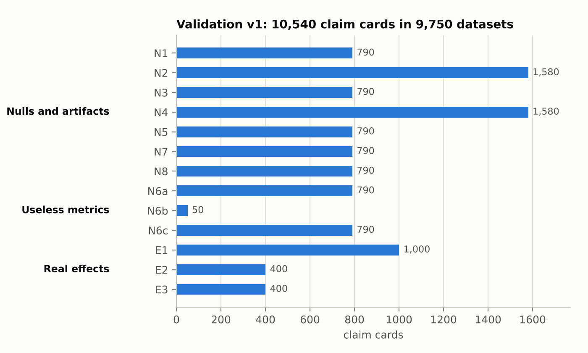
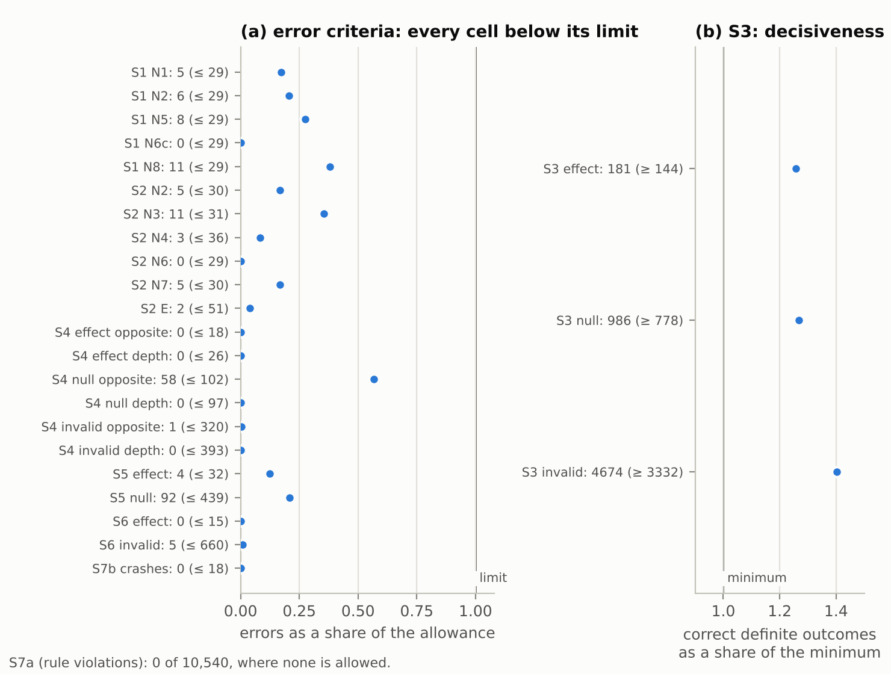
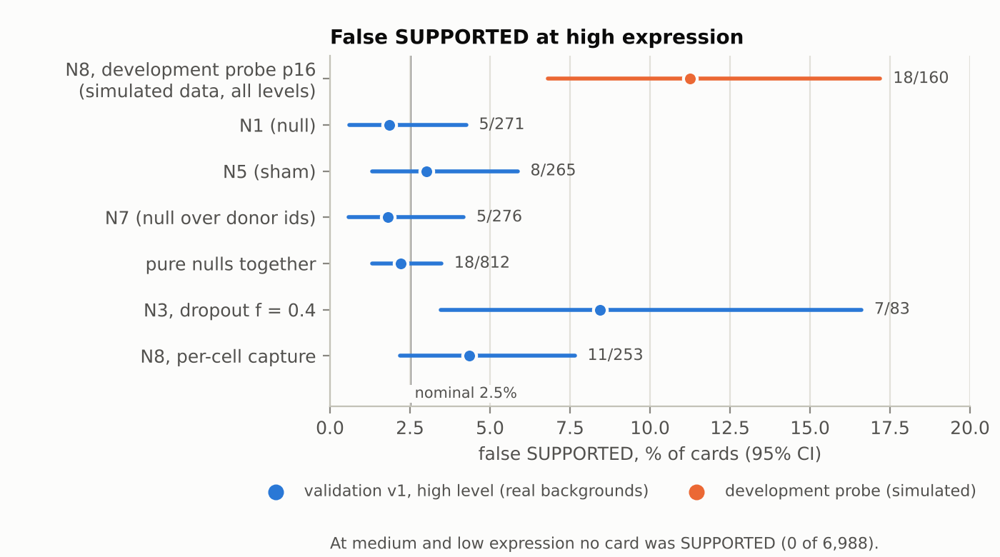
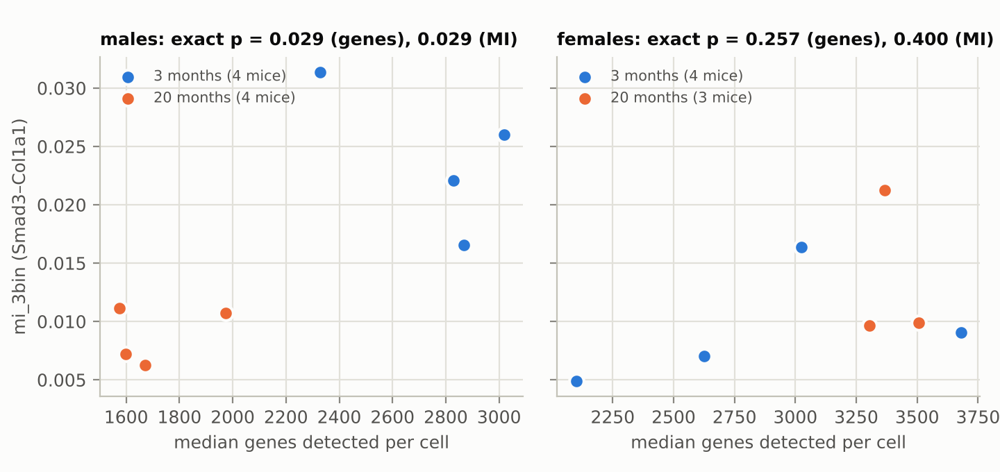
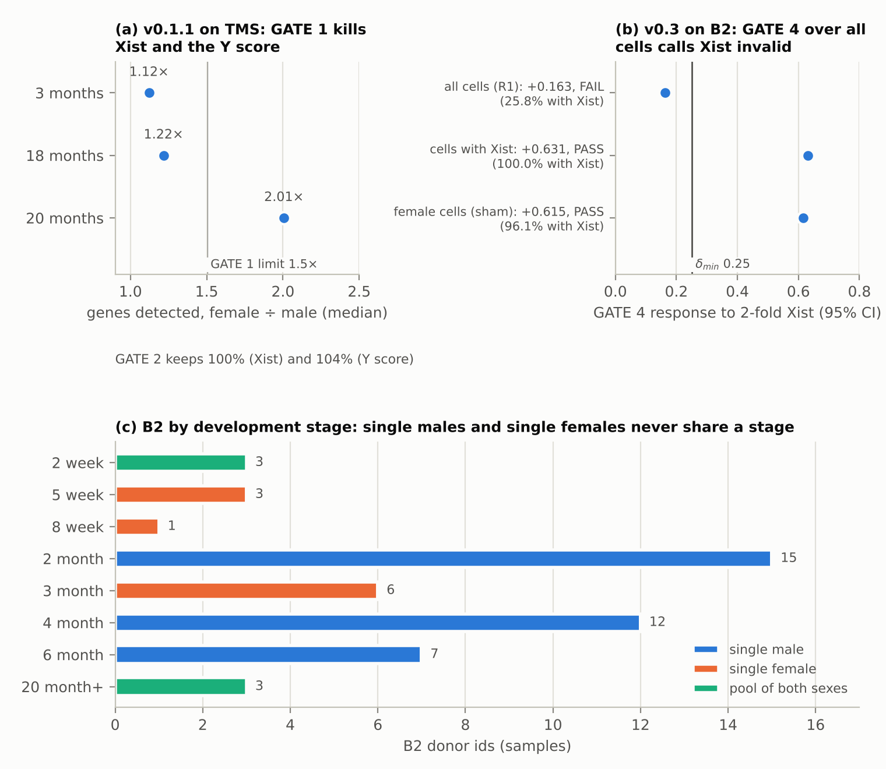

# Validating the validator: a blind, pre-registered test of artifact checks for single-cell metrics

*Draft of 2026-10-10, all sections, for the owner. Every number has its source in
[`paper/drafts/v03_manuscript_plan.md`](drafts/v03_manuscript_plan.md) or next to it, as a file
of this repository and a commit. The figures come from `paper/figures_v03/make_figures.py`.
`paper/manuscript.md` is the superseded v0.1.1 preprint.*

Theodor Spiro | ORCID 0009-0004-5382-9346

## Abstract

A metric that differs between single-cell conditions is often read as biology, although
sequencing depth, dropout and the study design can produce the same difference. metric-autopsy
runs a pre-registered claim through gates aimed at named artifacts and decides one verdict from
four fields: metric validity, design adequacy, an effect over biological replicates at equal
depth, and replication. Its first release (v0.1.1) erred in both directions on its own probes:
it passed a metric that returns random numbers and blocked a known sex difference. I rebuilt the
logic (v0.3) and froze it before a blind test. In a pre-registered blind validation with planted
truth on two real CELLxGENE backgrounds (9,750 datasets, 10,540 claim cards), v0.3 met all eight
pre-registered criteria within its scope: one metric, the binomial-thinning family of artifacts
and per-cell variable capture. Useless metrics never received SUPPORTED (0 of 1,630 cards), and
on the pure nulls with a valid metric a false SUPPORTED came on 2.2% of cards, at a nominal
2.5%. I had predicted that v0.3 would fail on per-cell variable capture; the prediction was not
confirmed. In a reading by expression level (exploratory, not a criterion), the metric is blind
at medium and low expression, where no false SUPPORTED occurred, and at high expression under
per-cell capture the rate was 4.3% (95% CI 2.2–7.6%) at a nominal 2.5%. The only real positive
control expected to be confirmed, the sex difference in Xist and the Y genes in mouse islets,
was not confirmed. The background allowed the sexes to be compared only inside pooled samples,
which the protocol had missed, and GATE 4 measured the metric's response to an injected Xist
signal over all cells, three quarters of which lack Xist, and so called a valid metric invalid.
The development data had erred in both directions: they overstated one error rate 2.6-fold and
did not reveal the GATE 4 defect. A validator must therefore be tested blind, on real
backgrounds, with real positive controls and with the settings a user would choose: on the panel
the injected signal's dose and the smallest effect size of interest (SESOI) came from a pilot,
that is, from the oracle that knew the planted truth. The protocol, the code, the drand key and
every verdict are open, and any dataset can be rebuilt from the tag and run again.

## 1. Introduction

The workflow behind many single-cell findings is short. A metric, such as a mutual information,
a correlation or an entropy, is computed in two groups of cells; the numbers differ; a sentence
about biology follows. Nothing in that workflow asks whether the metric could have moved for a
reason that is not biological: sequencing depth, dropout, a batch, or a design in which the
groups differ in more than the claim says. I call it "compute, then believe".

Three of my own analyses failed this way before this project began:
- Two entropies computed from one expression matrix, one within cells and one between them,
  looked anticorrelated with age. Two metrics of one matrix share a structural tendency that
  need not be biology, and the signal vanished on another platform and reversed at low
  sequencing depth.
- Outside single-cell data, a spectral exponent of the electrocardiogram, read as a marker of
  cardiac health, tracked the geometry of the conduction system, a property of the medium rather
  than of the patient.
- A mutual information between SMAD-pathway and extracellular-matrix genes seemed to decline
  with age in Tabula Muris Senis (Tabula Muris Consortium 2020). The decline followed a lower
  detection rate in old male cells (§5 audits this case).

I give no numbers for these cases: they come from an internal checklist with no script behind
it.

metric-autopsy turns the inversion of that workflow into a runnable sequence of gates: state the
commitments, red-team the metric, then believe. This paper reports four things. §2 shows how its
first release failed its own probes. §3 describes the rebuilt version. §4 reports a blind,
pre-registered validation of that version against truth planted in real data. §5 audits the
claim that started the project. The validation passed its criteria within a narrow scope; read
by expression level (exploratory, not a criterion), the metric was valid only at high
expression, where per-cell variable capture gave a false SUPPORTED on 4.3% of cards at a nominal
2.5%. The only real positive control expected to be confirmed was not confirmed, and the reasons
teach as much as the pass.

## 2. v0.1 and how it failed its own probes

Before the rework I wrote probes: small simulations with a known truth, each aimed at one way a
gate can err (`validation/probes/`, at the tag). The released v0.1.1 erred in both directions:
- **It passed a useless metric.** A metric that returns random numbers received "PASS — cleared
  3 auto gates" (probe p01). GATE 0 tested invariance only, and no gate asked for a response to
  a signal.
- **It blocked real biology.** "Xist is higher in female cells" died at GATE 1 on the demo data,
  because one stratum had a 2.00× gap in genes detected, although GATE 2 kept 100% of the effect
  under matching (p04).
- **It counted cells as replicates.** With 3 against 3 mice and no age effect, 22 of 40 runs
  reported an effect that "survives matching". An exact test over mice found an effect in none
  of the 40 runs (p07): the permutation unit was the cell.

The probes recorded 18 such failures as strict expected failures (`validation/probes/README.md`,
`baseline_v0.1.1.log`). They are a development set. They found the bugs and the fixes were built
against them, so they carry no confirmatory weight.

## 3. How v0.3 works

v0.3 decides a verdict from four fields by one rule, `report.decide`, which the Python API, the
command-line tool and the MCP server share:
- **Metric validity.** GATE 0 perturbs the user's own data (dropout, depth, library size) and
  separates a nuisance *bias* from *attenuation*. GATE 4 tests the metric's response to an
  injected signal. GATE 5 tests positive and negative controls against empirical nulls.
- **Design adequacy.** Whether the pre-registered estimand's correction is possible on these
  data, and how many biological replicates each group has. GATE 1, QC parity in every stratum,
  is a diagnostic, not a kill switch.
- **Effect.** GATE 2 corrects by the estimand: a composition claim is thinned to equal depth, a
  content claim to equal spike-in capture, and without spike-ins a content claim is
  UNIDENTIFIABLE. The effect is then inferred over biological replicates: an exact permutation
  test with at least four per group, a t interval marked "parametric only" with three, and no
  verdict with two or fewer.
- **Replication.** GATE 6 re-estimates the effect on independent data.

An invalid metric stops the analysis. SUPPORTED needs a metric whose response is shown by a
positive control or an injected signal, a replicate-level effect in the pre-registered direction
and resolved judgment gates. The pre-registration names the estimand, the direction, the
replicate unit and the SESOI, the smallest effect size of interest. Its hash is in every report,
and a run log counts the attempts at one claim.

On the development set v0.3 gave a verdict outside the allowed set on 1 of 190 cases, a false
SUPPORTED on 1 of 150 nulls, artifacts and useless metrics, and a definite verdict on 130 of 150
establishable cases, 129 of them correct (`validation/probes/verdicts_v0.3.0.dev0.log`). These
numbers carry no confirmatory weight either.

## 4. A blind, pre-registered validation of v0.3

### 4.1 Design

The engine was frozen as the tag `v0.3.0-prereg` (commit 90a7718) together with the protocol
(`validation/prereg/v1.md`). One workflow run executed the protocol from the tag, in one attempt
(workflow run 37990113304). The records it fixed before drawing the key are the run tag
`panel-v1-run` (commit 7782254). The key that chose the gene pairs and the claim cards was the
drand quicknet beacon's round 32929913, published after those records.

**Backgrounds.** A rule fixed in advance chose two backgrounds from the CELLxGENE Census
(release 2025-11-08; CZI Cell Science Program et al. 2025):
- **B1:** human oligodendrocytes of the MSSM cohort; nuclei, 10x 3' v3;
- **B2:** mouse pancreatic islet beta cells (Hrovatin et al. 2023); cells, 10x 3' v2 and v3. Its
  50 donor ids are samples: 6 of them are pools of both sexes, and all single females are of the
  NOD strain (§4.7).

The suspension type and assay come from the Census metadata (workflow run 38033204255).

**Claims.** Each claim card states what a user pre-registers: the estimand (composition), the
direction, the replicate unit (the donor) and the SESOI, the smallest effect size of interest,
on the metric's observed scale. δ_min, the smallest response to an injected signal that matters,
is 0.5 × SESOI: GATE 4 calls a metric invalid only when its response is shown below δ_min. Each
card passed the engine the SESOI of its background and expression level and the dose of GATE 4's
injected coupling, the saturation dose of that background and level, both set by a pilot before
the key. A user sets them without a pilot.

**Planted truth.** Known truth was planted into the backgrounds' real counts by binomial
thinning (Gerard 2020). Each background holds 24 gene pairs, 8 at each of three expression
levels. The one metric is the log-normalized Pearson correlation of a pair. The conditions (Fig.
1):
- **Nulls** (N1–N8): donor-label permutation (N1); N1 with capture loss (N2) or extra dropout
  (N3) in one group; pseudoreplication, 3 against 3 donors (N4); a within-donor sham (N5);
  useless metrics: a random number, a constant, a score of random genes (N6a–c); a label
  permutation over B2's donor ids (N7), which is a null at the level of the id, not of the
  mouse; and N1 with capture that varies from cell to cell (N8), outside the engine's correction
  family.
- **Real effects** (E1–E3): an injected coupling of the pair in one group (E1), alone or with a
  capture loss against it (E2) or with it (E3).

In all there are 9,750 datasets and 10,540 claim cards. For each card an oracle, which never
imports the engine, measured the truth about the metric on its pair: **valid**, **blind** or
**ambiguous** by its response to GATE 4's injection, at least 1.2 δ_min, at most 0.8 δ_min, or
in between; the metrics of N6 are **useless**.

**Criteria.** Eight criteria (S1–S7b) were each set by one principle: a sound validator passes
with probability at least 0.90, and one with twice the error passes with probability at most
0.05. A sound validator passes all of them together with probability 0.912 (`oc.log`).
- S1 bounds false SUPPORTED on each of the five key nulls;
- S2 bounds false SUPPORTED in the other null groups and on the real effects;
- S3 asks for correct definite outcomes where the truth can be established, a criterion of
  decisiveness, not of errors;
- S4 bounds false answers "opposite direction" and "explained by depth";
- S5 bounds false "metric invalid" on a valid metric;
- S6 bounds false NO DETECTABLE EFFECT;
- S7a allows no verdict that the engine's rules cannot give;
- S7b bounds crashes.

Three anchors on real data whose truth is public (R1–R3) are reported one by one, not pooled
into rates.

### 4.2 Result

v0.3 passed all eight criteria (`scores.txt`, branch `results/panel-v1`, commit adc7d65; Fig.
2):

| Criterion | Count | Allowed |
|---|---|---|
| S1 | N1 5, N2 6, N5 8, N6c 0, N8 11 (of 790 each) | ≤ 29 each |
| S2 | N2's other steps 5, N3 11, N4 3, N6a 0, N7 5 (of 790 each); real effects 2 of 1,285 | ≤ 30, 31, 36, 29, 30; ≤ 51 |
| S3 | real effects 181/189, nulls 986/1,075, invalid metrics 4,674/4,685; 16 of 16 conditions | ≥ 144, 778, 3,332 |
| S4 | real effects 0/515, 0/364; nulls 58/2,165, 0/1,147; invalid metrics 1/7,020, 0/4,261 | ≤ 18, 26; 102, 97; 320, 393 |
| S5 | real effects 4/206, nulls 92/2,252 | ≤ 32, 439 |
| S6 | real effects 0/121, invalid metrics 5/7,020 | ≤ 15, 660 |
| S7a | 0 of 10,540 | 0 |
| S7b | 0 of 10,540 | ≤ 18 |

Useless metrics never received SUPPORTED: 0 of 1,630 cards (N6a–c with the constant;
`validation/exploratory/v1_nulls_by_truth.log`). I had predicted that v0.3 would fail S1 on N8,
since per-cell variable capture is outside its correction. The prediction was not confirmed: 11
false SUPPORTED of 790, where S1 allows 29.

### 4.3 Error rates by expression level

This reading is exploratory, not a criterion, and was decided after the results
(`validation/exploratory/v1_by_level.log`, from `scores.json`; `v1_nulls_by_truth.log`, which
rebuilds each card's truth as `score.py` does; Fig. 3).
- On these backgrounds the metric is valid only at high expression: all 2,458 cards with a valid
  metric are at the high level. At the medium and low levels the metric is blind (55
  medium-level cards are ambiguous), and no card there was SUPPORTED (0 of 6,988).
- The pure nulls N1, N5 and N7 have a valid metric on all 812 of their high-level cards. They
  gave a false SUPPORTED on 18 of them, 2.2% (95% CI 1.3–3.5%), at a nominal 2.5%. Counting the
  answers against the direction too, N1, N5 and N7 gave 5.9%, 3.8% and 4.0%, at a nominal 5%.
- N8 at the high level gave a false SUPPORTED on 11/253 = 4.3% (95% CI 2.2–7.6%), at a nominal
  2.5%: 8 of its 221 cards with a valid metric (3.6%) and 3 of its 32 with an ambiguous one.
  Counting the answers against the direction too, it gave 22/253 = 8.7%, at a nominal 5%.
- N3 at f = 0.4 at the high level gave a false SUPPORTED on 7/83 = 8.4% (95% CI 3.5–16.6%), and
  on 10/83 = 12.0% counting the answers against the direction.

The pass on N8 has two causes. The first is dilution. Only 253 of N8's 790 cards could carry a
false SUPPORTED, because the metric is blind on the others. Had N8 kept its high-level rate on
all 790 cards, about 34 false SUPPORTED would be expected against S1's 29, and S1 would pass
with probability ≈ 0.20. The second is that on the cards at risk the rate, 4.3%, was well below
what the development probe p16 had given on simulated data: 18 of 160 datasets, 11.3%
(`validation/probes/p16_variable_capture_n8.log`). Not all of p16's datasets have a valid
metric: by its stand-in truth (`simulate.dry_pilot`) 112 of the 160 do, and the 48 at the low
level have a blind one. p16 does not record on which datasets its errors fell.

### 4.4 Limitations

- **The scope** is one metric, two backgrounds, the binomial-thinning family and N8. Nothing
  else is validated, `mi_3bin` included.
- **v0.3 does not correct capture that varies from cell to cell.** Its depth correction brings
  whole groups to one depth.
- **The design effects reach 5.62,** because datasets share donors (`scores.json`,
  `limitations`): beyond the backgrounds' own donors the error rates should be read with care.
- **GATE 0 refused 26 of N7's 276 high-level cards (9.4%).** Whether random groups of donor ids
  differ in depth, or GATE 0 is oversensitive, is open.
- **The SESOI and GATE 4's dose came from the pilot,** that is, from the oracle, on every card.
  A user sets both without a pilot. So v1 did not test the engine with the settings a user would
  choose.
- **GATE 4's module probe measures the response over all cells.** For a marker present in only
  some cells it can call a valid metric invalid (§4.7). v1's panel used the module probe only on
  the useless metric N6c, so v1 did not test this path.
- **With the module probe's default, a valid mean-expression metric fails GATE 4 at a SESOI of
  0.5.** The default raises the marker 2-fold in a random 30% of cells, so the response over all
  cells is about 0.3 × the share of cells with the marker × the response those cells give when
  every one of them is raised. At the depth of B2's cells (about 20,000 counts) the largest
  response on synthetic counts, with the marker in every cell, was +0.205 (upper bound +0.206)
  against δ_min 0.25; on 1,000 of B2's own Xist cells it was +0.189 (upper bound +0.191). At a
  depth of 2,000 counts the default passed markers seen mostly as single counts (+0.358 and
  +0.352), because the sham's thinning drops single counts to zero, not because of the 2-fold
  change (`validation/exploratory/gate4_module_dilution.log`). The command-line tool and the MCP
  server offer only the coupling probe, so the module probe is reached through the Python API
  (`injected_signal.module`).

### 4.5 Checks after the run

- `score.py`, run again on the published reports, reproduces every criterion.
- `blind.py verify` rebuilt the first 20 datasets on another CPU model. All 20 datasets are
  identical, and all 22 reports agree: 16 byte for byte, 6 within 1e-9, with the same verdicts
  and causes (`validation/exploratory/v1_verify_first20.log`).

### 4.6 The anchors R2 and R3

R2 compares mouse embryonic stem cells sorted by DNA content (B3; Buettner et al. 2015), which
carry ERCC spike-ins:
- **R2a**, the G2M score, G2M against G1: INCONCLUSIVE;
- **R2b**, total RNA with the spike-ins: INCONCLUSIVE;
- **R2c**, total RNA without the spike-ins: UNIDENTIFIABLE.

Each is in its allowed set. R2 is a real positive control too, but its known difference could
not be confirmed by design: each phase is one capture batch, so there are no replicates. R3 was
dropped with its background, whose deposited counts are not raw.

### 4.7 The only real positive control

**The anchor.** R1 asks for a known difference on B2: the sex markers, female against male mice,
within the development stage, with the donor id as the mouse. The claims:
- Xist decreases from female to male;
- the Y-gene score (Ddx3y, Eif2s3y, Kdm5d, Uty) increases;
- a sham compares female mice split at random.

The metric is the mean over cells of log1p CP10k of the marker's counts (for the Y score, of the
four genes' summed counts), with a SESOI of 0.5 and so δ_min = 0.25. The SESOI and the probe
(module, 2-fold in every cell) were constants of `anchors.py` at the tag ([lines
45–46](https://github.com/mool32/metric-autopsy/blob/90a7718f77a46440ca11cd90150733a67f6b138d/validation/prereg/anchors.py#L45-L46):
`SESOI = 0.5`; `MODULE_FOLD, MODULE_FRAC = 2.0, 1.0`), fixed before any result, not chosen after
it. The allowed outcomes were SUPPORTED for both markers, and NO DETECTABLE EFFECT or
INCONCLUSIVE for the sham. R1 did not run in v1, because of a loading bug. It ran once after the
results, outside v1, with only the loader fixed (DEVIATIONS.md D1; workflow run 38033821978;
branch `results/panel-v1-r1`).

**B2's structure** (`validation/exploratory/b2_sex_structure.log`, workflow run 38045140802).
B2's 50 donor ids are samples. By the share of their cells with Xist > 0:
- **34 single males**, Xist in 0.0–1.5% of their cells and a Y gene in 68.0–94.2%: Fltp_adult 4,
  STZ 7, VSG 8, spikein_drug 15;
- **10 single females**, 98.0–100.0% and 0.0–0.7%: NOD 3, NOD_elimination 7, all of the NOD
  strain;
- **6 pools of both sexes**, 53.0–80.0% and 33.8–45.8%: Fltp_P16 at 2 weeks, Fltp_2y at 20
  months and over. Of each pool's 400 cells, 227–267 are annotated female and 133–173 male.

The source atlas agrees (Hrovatin et al. 2023; its code at commit 3af65e4 of
theislab/mouse_cross-condition_pancreatic_islet_atlas):
- Its [sample
  table](https://github.com/theislab/mouse_cross-condition_pancreatic_islet_atlas/blob/3af65e46dd530c5faa0e8efa65004ef50fcc0309/reproducibility/code/data_exploration/atlas/10_sample_metadata_summary.ipynb)
  lists the six pools as "mixed" and all twelve of its NOD samples as female; B2 holds ten of
  them.
- Its CELLxGENE submission says of `donor_id`: "This is ID of a sample and not donor. Some
  samples were pooled accross [sic] animals" ([`25-1_prepare_cellxgene.py`, lines
  643–644](https://github.com/theislab/mouse_cross-condition_pancreatic_islet_atlas/blob/3af65e46dd530c5faa0e8efa65004ef50fcc0309/reproducibility/code/prepare_submit/25-1_prepare_cellxgene.py#L643-L644)).
- In the pools each cell's sex was set by a threshold on a score of the Y-chromosome genes, all
  of them in the data except Gm47283 and Gm29650 (`2_annotate_Fltp_2y.py`, its "Sex scores"
  block, lines
  [414–436](https://github.com/theislab/mouse_cross-condition_pancreatic_islet_atlas/blob/3af65e46dd530c5faa0e8efa65004ef50fcc0309/reproducibility/code/preprocessing/2_annotate_Fltp_2y.py#L414-L436)
  and
  [474](https://github.com/theislab/mouse_cross-condition_pancreatic_islet_atlas/blob/3af65e46dd530c5faa0e8efa65004ef50fcc0309/reproducibility/code/preprocessing/2_annotate_Fltp_2y.py#L474);
  the same in `2_annotate_Fltp_P16.py`, lines
  [398–420](https://github.com/theislab/mouse_cross-condition_pancreatic_islet_atlas/blob/3af65e46dd530c5faa0e8efa65004ef50fcc0309/reproducibility/code/preprocessing/2_annotate_Fltp_P16.py#L398-L420)
  and
  [458](https://github.com/theislab/mouse_cross-condition_pancreatic_islet_atlas/blob/3af65e46dd530c5faa0e8efa65004ef50fcc0309/reproducibility/code/preprocessing/2_annotate_Fltp_P16.py#L458)).
- The submission marks this sex "data-driven": "determined bsed [sic] on Y-chromosomal gene
  expression" (`25-1_prepare_cellxgene.py`, lines
  [419–431](https://github.com/theislab/mouse_cross-condition_pancreatic_islet_atlas/blob/3af65e46dd530c5faa0e8efa65004ef50fcc0309/reproducibility/code/prepare_submit/25-1_prepare_cellxgene.py#L419-L431)
  and
  [640–641](https://github.com/theislab/mouse_cross-condition_pancreatic_islet_atlas/blob/3af65e46dd530c5faa0e8efa65004ef50fcc0309/reproducibility/code/prepare_submit/25-1_prepare_cellxgene.py#L640-L641)).

No development stage holds a single male and a single female:

| Development stage (Census) | Single males | Single females | Pools of both sexes |
|---|---|---|---|
| 2 weeks | — | — | 3 (Fltp_P16) |
| 5 weeks | — | 3 (NOD) | — |
| 8 weeks | — | 1 (NOD_elimination) | — |
| 2 months | 15 (spikein_drug) | — | — |
| 3 months | — | 6 (NOD_elimination) | — |
| 4 months | 12 (Fltp_adult, VSG) | — | — |
| 6 months | 7 (STZ) | — | — |
| 20 months and over | — | — | 3 (Fltp_2y) |

Within a stage the sexes meet only inside the pools.

**The outcome.** Two of R1's three claims are outside their allowed sets:

| Claim | Verdict | Allowed |
|---|---|---|
| Xist | NOT SUPPORTED: metric invalid (GATE 4: +0.1627, 95% CI +0.1626 to +0.1628, against δ_min 0.25) | SUPPORTED |
| Y genes | UNIDENTIFIABLE: the donor ids are partially crossed with sex | SUPPORTED |
| Sham, female against female | NO DETECTABLE EFFECT | NO DETECTABLE EFFECT, INCONCLUSIVE |

The two failures have different causes.

**The Y genes: UNIDENTIFIABLE, which reads B2 correctly; the protocol erred.** Within a stage
the sexes can be compared only inside the pools, so neither a nested nor a paired comparison of
mice is valid. The engine's design rules say so:
- with the pools, the ids are partially crossed with sex (`effect._replicate_design`);
- without them, no stage holds both sexes, and GATE 1 stops.

Inside the pools a comparison of the Y genes would be circular, since the cells' sex there was
assigned from the Y genes. A comparison of Xist by that sex inside the pools would not be
circular, but it would compare cells, not mice. The protocol's allowed set, SUPPORTED, was
wrong. It counted the ids of each sex over all stages (16 female and 40 male: a pool counts for
both). It checked neither that an id is one animal of one sex nor that both sexes share a
stratum. The design of the Xist claim is UNIDENTIFIABLE for the same reason, but metric validity
decides first.

**Xist: a false "metric invalid", an engine defect.** GATE 4's module probe raises Xist 2-fold
in every cell (the other genes are thinned to half, against a sham that thins every gene) and
measures the metric over all cells. 74.2% of B2's cells have no Xist, and there the probe
changes nothing. The same probe, with the same 200 injections, gives on three sets of cells:

| Cells | Cells with Xist | Response (95% CI) | GATE 4 |
|---|---|---|---|
| all: R1's Xist claim | 25.8% | +0.1627 (+0.1626 to +0.1628) | FAIL |
| with Xist > 0 (5,027 cells) | 100% | +0.6310 (+0.6304 to +0.6315) | PASS |
| female: R1's sham claim (4,976 cells) | 96.1% | +0.6149 (+0.6144 to +0.6154) | PASS |

So the metric responds to Xist where Xist is. The all-cell response, 0.163, is close to the
share of cells with Xist times the response there, 0.258 × 0.631: the cells without Xist dilute
it. R1's probe would have passed from about 40% of cells with Xist (0.25 / 0.631, or 39.6%). In
1,000 of B2's own cells drawn at a given share of cells with Xist, the threshold is 39.8% (0.25
/ 0.628): the probe failed at 34.8% and passed at 44.8%
(`validation/exploratory/gate4_module_dilution.log`). For a weaker marker the response in the
cells that carry it is smaller, and the share it needs is larger. On synthetic counts at B2's
depth the share needed was 55.3% for a marker at about 1 CP10k where present, 38.4% at 6 (as
B2's Xist) and 36.6% at 50. v1 never tested this path, because its panel used the module probe
only on the useless metric N6c. In the anchors the probe ran on four valid metrics and passed on
three: R2a's G2M score, R1's Y-gene score, and R1's sham, which is the same Xist metric on the
female cells only.

**The sham was right.** Female against female mice, it gave NO DETECTABLE EFFECT (TOST within
±0.5).

**Both versions on their real positive controls.** On Tabula Muris Senis v0.1.1 killed its real
positive controls, Xist and the Y-gene score, at GATE 1 (2.01× in the 20-month stratum),
although its own GATE 2 retained 100% and 104% of the effects
(`validation/flagship_audit/REPORT.md`, section F). v0.3 removed that failure: its GATE 1 is a
diagnostic, not a kill switch. But the control was still not confirmed, because another gate,
GATE 4, failed it, and B2's design could not have confirmed it either. The targets of v0.4 are a
GATE 4 that measures the response where the signal is claimed (within a group, or over the
replicates), and backgrounds for a sex control whose ids are each one animal of one sex, with
both sexes in one stratum.

## 5. The claim that started the project, audited

The v0.1.1 preprint's §4 reported `mi_3bin`, the mutual information of Smad3 and Col1a1 on a
three-bin discretization, between young and old mice of Tabula Muris Senis, and read its failure
at GATE 0 as a "sex-by-age detection artifact". An audit pinned to v0.1.1 re-ran it on the real
data (workflow run 37990113298; branch `results/flagship-audit` at d2a5420; its report is
`validation/flagship_audit/REPORT.md`).

**v0.1.1's verdict reproduces.** `mi_3bin` fails at GATE 0, with a dropout shift of 43.0% (z =
54.7). GATE 1 flags the male stratum (a 1.646× ratio of genes detected). Under matching GATE 2
leaves 43% of the pooled effect's size and 30% of the male one's, both with the sign reversed.
The negative control's MI is 0.036, and GATE 5 fails.

**That verdict says little about biology.**
- On the same data v0.1.1 also kills the positive controls, Xist and the Y-gene score, female
  against male, at GATE 1: the ratio is 2.01× in the 20-month stratum, where 728 female cells
  meet 31,551 male cells. Yet GATE 2 keeps 100% and 104% of those effects, and the sex markers
  match the label in 21 of 21 donor units. A GATE 1 failure on these data does not tell an
  artifact from biology (Fig. 5a).
- The data have no spike-ins: 0 of the Census's 53,384 features, and 0 in each of the 17 source
  files. A technical drop in capture cannot be told apart from a biological drop in RNA content.

**The design is not the one the preprint described.** Its "old (20 months)" group is 4 males
aged 24 months (31,551 cells) and 3 females aged 21 months, whose 728 cells all come from the
mammary gland. Two of the young "units" are composite ids, each naming two mice that are also
counted on their own.

**Per mouse, without the composite ids** (`validation/flagship_audit/mouse_level.py` and `.log`;
Fig. 4):
- In males, 4 young against 4 old, median genes detected and `mi_3bin` both separate the ages
  completely: exact two-sided p = 2/70 = 0.029 for each.
- In females, 4 young against 3 old, p = 9/35 for genes detected and 14/35 for `mi_3bin`.

So detection falls with the metric in the males. A per-mouse test cannot say whether the fall is
technical or biological, since there are no spike-ins. I drop two claims of the preprint: that
female detection does not decline, and that there is a sex-by-age interaction. The old females
come from one tissue, the young from many, so neither claim is established.

## 6. Related work

**Pseudoreplication.** Cells of one animal are not independent replicates (Hurlbert 1984; Lazic
2010). In single-cell differential expression, tests over cells give false discoveries that
tests over biological replicates avoid (Squair et al. 2021; Zimmerman et al. 2021; Crowell et
al. 2020). v0.3 infers every effect over replicates. R1 adds the converse risk: a donor id need
not be one animal.

**Detection rate as a confounder.** The share of genes a cell detects varies for technical
reasons and tracks the main axes of variation in single-cell data (Hicks et al. 2018); MAST
models it as a covariate (Finak et al. 2015). Droplet counts fit sampling without zero inflation
(Svensson 2020), which supports binomial thinning both as a depth correction and as a way to
plant truth in real counts (Gerard 2020).

**Spike-ins and normalization.** Scaling normalization assumes that most genes do not change. A
global change in RNA content needs an external standard (Lovén et al. 2012), and spike-ins have
their own limits in single cells (Risso et al. 2014; Lun et al. 2017; Vallejos et al. 2017).
Other normalizations (Lun, Bach & Marioni 2016; Hafemeister & Satija 2019) leave this choice
open as well. v0.3 makes it explicit through the estimand: composition is corrected by thinning
to equal depth, content needs spike-ins, and without them it is UNIDENTIFIABLE (R2c).

**Benchmarking against validation.** Benchmarks compare methods across datasets with known truth
(Weber et al. 2019; Soneson & Robinson 2018; Luecken et al. 2022). metric-autopsy asks another
question: whether one number on one dataset measures what the claim says. That is construct
validity in its causal sense (Borsboom et al. 2004), argued rather than scored (Kane 2013), with
negative controls (Lipsitch et al. 2010), equivalence against a SESOI (Lakens 2017) and
pre-registration (Nosek et al. 2018). I tested the validator itself the same way: blind, against
planted truth, with real positive controls.

## 7. Discussion

**The gates are necessary, not sufficient.** A verdict is a statement about one dataset under
the declared assumptions, not about biology. The validation measures how often the engine errs
on the artifacts it was built for. It does not say that a SUPPORTED claim is true.

**Count errors where they can occur.** On real backgrounds the metric was blind at two of the
three expression levels, and those cards could not carry a false SUPPORTED. A criterion pooled
over all cards was diluted by them, and N8 passed partly for that reason. A criterion of false
SUPPORTED should be counted by expression level, or only on the cards whose metric is valid or
ambiguous.

**The development data erred in both directions.** The simulated probe p16 put N8's rate 2.6
times above the real high-level rate. No development probe showed GATE 4's failure on a marker
present in only some cells. A validator developed on simulations can look worse and better than
it is, so its development data should be real backgrounds.

**v1 measured the engine with the oracle's settings.** On every card the SESOI and GATE 4's dose
came from the pilot, that is, from the oracle. A user has no oracle. With the module probe's
default, 2-fold in 30% of cells, a valid mean-expression metric of a gene cannot reach δ_min at
a SESOI of 0.5 at B2's depth; what passes at a low depth passes on the sham's dropout of single
counts, not on the 2-fold change. The next validation must test the engine with its defaults, or
with the rule by which a user picks them.

**A positive control must be checked before it is pre-registered.** R1's allowed set assumed
that a donor id is one mouse and that both sexes share a stage. Neither held in B2, and the
source atlas says so in its own metadata. A sex control needs ids that are each one animal of
one sex, checked by Xist and the Y genes, with both sexes in one stratum. Its allowed set should
be computed by the engine's own design rules.

**The targets of v0.4** are per-cell variable capture (N8), entry-level dropout (N3 at f = 0.4),
and a GATE 4 that measures the response where the signal is claimed (within a group, or over the
replicates), not over all cells. They need a new pre-registration, and GATE 0's refusals on N7
need an explanation first. Step 4 of the validation plan (`PROJECT.md`), external verdicts,
comes next.

## 8. Methods

### 8.1 The engine

The engine is the package `metric_autopsy` at the tag `v0.3.0-prereg` (`src/`, git tree
97cbab3c…). The gates take a black-box `metric(data) -> float`. The data are any object with
counts `.X`, cell annotations `.obs` and gene names.
- **GATE 0** perturbs the user's data (extra dropout, depth halved, library sizes scaled) and
  classifies each shift of the metric against a bootstrap baseline and an automatic null without
  gene–gene structure, in which each gene takes the count of a random neighbouring cell at least
  as deep, thinned to the cell's depth. A bias, a nuisance that moves the null or inflates the
  signal, is reported, not failed, when the declared correction removes it between groups (depth
  under thinning); any other bias fails only when it and the lower bound of its 95% interval
  exceed `bias_tolerance` × SESOI (0.5 × SESOI by default). Attenuation, a shrinking toward the
  null, is reported and feeds the power check.
- **GATE 1** compares the groups' QC (genes detected) in every stratum of the declared factors,
  with bootstrap intervals and a Bonferroni correction. It warns; it stops only when no stratum
  holds both groups.
- **GATE 2** thins the deeper group's counts binomially, by one common ratio within each
  stratum, to equal depth for a composition estimand; for a content estimand it thins to equal
  spike-in capture, and without spike-ins the claim is UNIDENTIFIABLE.
- **The effect** is inferred over the replicate unit, nested in the groups or paired within
  them: an exact or Monte Carlo permutation test with at least four replicates per group, a t
  interval marked "parametric only" with three, no verdict with two or fewer. "No detectable
  effect" needs an equivalence test (TOST) within the SESOI.
- **GATE 4** injects a known construct change by binomial thinning, 200 times, each against a
  matched sham: the same thinning without the signal. A coupling thins two genes with one
  per-cell keep probability; its sham thins them independently. A module raises the relative
  expression of some genes 2-fold in a random share of cells (`frac`, default 0.3) by thinning
  every other gene; its sham thins every gene in an independent random draw of the same share.
  GATE 4 fails when the upper 95% bound of the mean response is below δ_min, even if the
  interval lies above 0; otherwise it passes when the lower bound is above 0, and is untested
  when neither holds.
- **GATE 5** compares the negative control with unrelated pairs of matched expression, and the
  positive control with draws of itself in which one gene's counts come from neighbouring cells
  of matched depth, in every stratum.
- **GATE 6** re-estimates the effect on independent data.
- **The verdict** is `report.decide` over the four fields, with its cause
  (`report.decide_cause`).

### 8.2 The panel

- **Backgrounds.** `validation/prereg/select_backgrounds.py` applied v1.md's rule (section 3.1)
  to the CELLxGENE Census, release 2025-11-08: primary droplet 3' data, one cell type of one
  dataset, enough donors with at least 200 cells, raw counts. It kept at most 400 cells per
  donor and, per background, the named genes and then the most expressed, 2,000 in all.
- **Pairs.** For each background and expression level (low: detected in 10–50% of cells; medium:
  in at least half, mean below 2 counts per cell; high: in at least half, mean at least 2), the
  8 most correlated disjoint pairs, each with its own negative control, the candidate most
  typical of GATE 5's matched null; and one positive control per background, the next most
  correlated pair of the high level.
- **Datasets.** Each condition planted its truth by binomial thinning (`panel.py`). The key, a
  drand round, drew each dataset's pair uniformly over the pool, independently of the condition
  (`panel.assign`).
- **Cards.** A card gives the engine the claim (estimand, direction, replicate column, SESOI on
  the observed scale and δ_min = 0.5 × SESOI) and GATE 4's injected signal: for the pair metric,
  a coupling at the saturation dose of the background and level; for N6c, the G2M module at fold
  2 in 30% of cells. The SESOI and the dose of each background and level came from the pilot
  (`pilot.json`, fixed in the run tag before the key).
- **Truth.** The oracle (`oracle.py`, which never imports the engine) measured each pair's
  population response to GATE 4's injection, against the matched sham, on null datasets of the
  background's design, and on a condition's own datasets where the condition changes the pair's
  counts or the dataset's size. It classified the metric on the pair as valid (≥ 1.2 δ_min),
  blind (≤ 0.8 δ_min) or ambiguous. Each condition's allowed outcomes follow from that truth by
  one rule (v1.md section 3.2).

### 8.3 The criteria

Each criterion is a set of cells that must all pass, sized by one principle (v1.md section 6):
it passes a sound validator with probability ≥ 0.90 and a validator whose error is double the
nominal with probability ≤ 0.05, at the most lenient threshold that keeps the second ≤ 0.05. The
nominal errors are the rules' designed sizes: α/2 = 2.5% for a false SUPPORTED, 2α = 10% for a
false "metric invalid" on a valid metric, α = 5% for a false NO DETECTABLE EFFECT or "explained
by depth". A sound validator follows the engine's rules correctly, in the engine's verdict
order, with its errors at the designed sizes or at the odds the pilot measured on each case
(`oc.sound_model`). `oc.py` computed the operating characteristics by simulation before the key:
P(all criteria pass | sound) = 0.912, 0.913 and 0.912 in three scenarios for the truth (100,000
simulations each; `validation/prereg/oc.log`).

### 8.4 The key and the run

The run tag's message named a drand quicknet round at least an hour after the tag's push. The
round's randomness, fetched from four relays and verified against the chain's public key
(`beacon.py`), became the key: `7bb8eab6…`, round 32929913. `.github/workflows/validation.yml`
ran everything from the tag: the selection, the pilot, the run tag, the key, 20 shards of the
panel, the scores and the anchors. Every job first checked that the frozen files were the tag's
(`frozen.py`), and a re-run of a job stopped (one attempt). The environment was pinned as its
whole closure (`requirements-panel.txt`: CPython 3.13.16, numpy 2.5.3, pandas 2.3.3, scipy
1.18.1, on ubuntu-24.04) with single-threaded BLAS.

### 8.5 After the run

All analyses after the results are exploratory and change no verdict:
- the rates by expression level (`validation/exploratory/v1_by_level.py`) and by the metric's
  truth (`v1_nulls_by_truth.py`);
- B2's structure by sex and GATE 4's probe for R1's Xist claim, on the original B2 in workflow
  run 38045140802 (`b2_sex_structure.py`);
- the module probe's response against `frac` and the share of cells with the marker, on
  synthetic counts and on B2's cells (`gate4_module_dilution.py`);
- the audit's mouse-level test without the composite ids
  (`validation/flagship_audit/mouse_level.py`);
- a rebuild of the first 20 datasets on another CPU (`blind.py verify`).

R1 ran once, after the results and outside v1, with only its loader fixed
(`validation/prereg/DEVIATIONS.md`, D1; workflow run 38033821978).

### 8.6 Roles and the use of AI

I made every decision in this work and approved the protocol (v1.md, approved on 2026-10-09 at
commit 90a7718). Claude (Anthropic) was a conceptual partner throughout. Agents of Claude Code
wrote the code, ran the runs and carried out five independent reviews of the code against the
protocol before the tag, each by a separate agent with a clean context, given my task verbatim.
Each review was posted unedited on the pull request
(https://github.com/mool32/metric-autopsy/pull/1), and v1.md section 10 lists the decisions and
changes they led to. An agent of Claude Code also drafted this text under my direction; I am
responsible for its content.

## 9. Data and code availability

- **Code.** https://github.com/mool32/metric-autopsy (MIT license). The engine and the protocol
  are at the tag `v0.3.0-prereg` (commit 90a7718), and the run's records at the tag
  `panel-v1-run` (commit 7782254).
- **Results.** Branch `results/panel-v1` holds the reports of all 10,540 cards, the scores
  (commit adc7d65) and the anchors. Branch `results/panel-v1-r1` holds R1's run (commit
  36a04bf), and `results/flagship-audit` the TMS audit (commit d2a5420). The exploratory scripts
  and their logs are in `validation/exploratory/`.
- **Data.** The backgrounds come from the CELLxGENE Census, release 2025-11-08: B1 is dataset
  37a17b78-4864-4a42-b67b-31c00962795a, B2 dataset 49e4ffcc-5444-406d-bdee-577127404ba8
  (Hrovatin et al. 2023). B3 is ArrayExpress E-MTAB-2805 (Buettner et al. 2015). Tabula Muris
  Senis came through the Census (Tabula Muris Consortium 2020). Their sha256 are in the run
  tag's `backgrounds.json`. The compact backgrounds the shards read are in `results/panel-v1`
  (`compact.tar`, in two parts).
- **Reproduction.** The key (`key.json`) and `pilot.json` determine every dataset and card.
  `validation/prereg/blind.py verify` rebuilds datasets from the tag and runs the engine on them
  again, and `score.py` recomputes the scores from the reports.

## References

- Borsboom D, Mellenbergh GJ, van Heerden J (2004). The concept of validity. *Psychol Rev*
  111(4):1061–1071. doi:10.1037/0033-295X.111.4.1061
- Buettner F, Natarajan KN, Casale FP, et al. (2015). Computational analysis of cell-to-cell
  heterogeneity in single-cell RNA-sequencing data reveals hidden subpopulations of cells. *Nat
  Biotechnol* 33:155–160. doi:10.1038/nbt.3102
- Crowell HL, Soneson C, Germain P-L, et al. (2020). muscat detects subpopulation-specific state
  transitions from multi-sample multi-condition single-cell transcriptomics data. *Nat Commun*
  11:6077. doi:10.1038/s41467-020-19894-4
- CZI Cell Science Program, Abdulla S, Aevermann B, Assis P, et al. (2025). CZ CELLxGENE
  Discover: a single-cell data platform for scalable exploration, analysis and modeling of
  aggregated data. *Nucleic Acids Res* 53(D1):D886–D900. doi:10.1093/nar/gkae1142
- Finak G, McDavid A, Yajima M, et al. (2015). MAST: a flexible statistical framework for
  assessing transcriptional changes and characterizing heterogeneity in single-cell RNA
  sequencing data. *Genome Biol* 16:278. doi:10.1186/s13059-015-0844-5
- Gerard D (2020). Data-based RNA-seq simulations by binomial thinning. *BMC Bioinformatics*
  21:206. doi:10.1186/s12859-020-3450-9
- Hafemeister C, Satija R (2019). Normalization and variance stabilization of single-cell
  RNA-seq data using regularized negative binomial regression. *Genome Biol* 20:296.
  doi:10.1186/s13059-019-1874-1
- Hicks SC, Townes FW, Teng M, Irizarry RA (2018). Missing data and technical variability in
  single-cell RNA-sequencing experiments. *Biostatistics* 19(4):562–578.
  doi:10.1093/biostatistics/kxx053
- Hrovatin K, Bastidas-Ponce A, Bakhti M, et al. (2023). Delineating mouse β-cell identity
  during lifetime and in diabetes with a single cell atlas. *Nat Metab* 5:1615–1637.
  doi:10.1038/s42255-023-00876-x
- Hurlbert SH (1984). Pseudoreplication and the design of ecological field experiments. *Ecol
  Monogr* 54(2):187–211. doi:10.2307/1942661
- Kane MT (2013). Validating the interpretations and uses of test scores. *J Educ Meas*
  50(1):1–73. doi:10.1111/jedm.12000
- Lakens D (2017). Equivalence tests: a practical primer for t tests, correlations, and
  meta-analyses. *Soc Psychol Personal Sci* 8(4):355–362. doi:10.1177/1948550617697177
- Lazic SE (2010). The problem of pseudoreplication in neuroscientific studies: is it affecting
  your analysis? *BMC Neurosci* 11:5. doi:10.1186/1471-2202-11-5
- Lipsitch M, Tchetgen Tchetgen E, Cohen T (2010). Negative controls: a tool for detecting
  confounding and bias in observational studies. *Epidemiology* 21(3):383–388.
  doi:10.1097/EDE.0b013e3181d61eeb
- Lovén J, Orlando DA, Sigova AA, et al. (2012). Revisiting global gene expression analysis.
  *Cell* 151(3):476–482. doi:10.1016/j.cell.2012.10.012
- Luecken MD, Büttner M, Chaichoompu K, et al. (2022). Benchmarking atlas-level data integration
  in single-cell genomics. *Nat Methods* 19:41–50. doi:10.1038/s41592-021-01336-8
- Lun ATL, Bach K, Marioni JC (2016). Pooling across cells to normalize single-cell RNA
  sequencing data with many zero counts. *Genome Biol* 17:75. doi:10.1186/s13059-016-0947-7
- Lun ATL, Calero-Nieto FJ, Haim-Vilmovsky L, Göttgens B, Marioni JC (2017). Assessing the
  reliability of spike-in normalization for analyses of single-cell RNA sequencing data. *Genome
  Res* 27(11):1795–1806. doi:10.1101/gr.222877.117
- Nosek BA, Ebersole CR, DeHaven AC, Mellor DT (2018). The preregistration revolution. *Proc
  Natl Acad Sci USA* 115(11):2600–2606. doi:10.1073/pnas.1708274114
- Risso D, Ngai J, Speed TP, Dudoit S (2014). Normalization of RNA-seq data using factor
  analysis of control genes or samples. *Nat Biotechnol* 32:896–902. doi:10.1038/nbt.2931
- Soneson C, Robinson MD (2018). Bias, robustness and scalability in single-cell differential
  expression analysis. *Nat Methods* 15:255–261. doi:10.1038/nmeth.4612
- Squair JW, Gautier M, Kathe C, et al. (2021). Confronting false discoveries in single-cell
  differential expression. *Nat Commun* 12:5692. doi:10.1038/s41467-021-25960-2
- Svensson V (2020). Droplet scRNA-seq is not zero-inflated. *Nat Biotechnol* 38:147–150.
  doi:10.1038/s41587-019-0379-5
- Tabula Muris Consortium (2020). A single-cell transcriptomic atlas characterizes ageing
  tissues in the mouse. *Nature* 583:590–595. doi:10.1038/s41586-020-2496-1
- Vallejos CA, Risso D, Scialdone A, Dudoit S, Marioni JC (2017). Normalizing single-cell RNA
  sequencing data: challenges and opportunities. *Nat Methods* 14:565–571.
  doi:10.1038/nmeth.4292
- Weber LM, Saelens W, Cannoodt R, et al. (2019). Essential guidelines for computational method
  benchmarking. *Genome Biol* 20:125. doi:10.1186/s13059-019-1738-8
- Zimmerman KD, Espeland MA, Langefeld CD (2021). A practical solution to pseudoreplication bias
  in single-cell studies. *Nat Commun* 12:738. doi:10.1038/s41467-021-21038-1

## Figures

All five come from `paper/figures_v03/make_figures.py`, which reads the published files named in
its docstring; every number drawn is also in the text.

**Fig. 1. The design of validation v1.** Claim cards per condition, grouped by what the data
are. N2 and N3 hold several steps of their artifact; N4 has two cards per dataset, without and
with the replicate unit; E1 has five doses. The key, drand quicknet round 32929913, drew every
dataset's gene pair after the run's records were fixed.

**Fig. 2. The criteria against their limits** (`scores.json`, results/panel-v1 adc7d65). (a)
Every cell of the error criteria as a share of its allowance; each label gives the count and the
limit. (b) S3, correct definite outcomes as a share of the required minimum, by stratum; its 16
per-condition cells pass too.

**Fig. 3. False SUPPORTED at high expression, by condition** (exploratory, not a criterion;
`v1_by_level.log`, `v1_nulls_by_truth.log`). Points are rates with 95% Clopper–Pearson
intervals; the line marks the nominal 2.5%. The development probe p16 ran on simulated data, at
all levels together.

**Fig. 4. Tabula Muris Senis per mouse** (`audit_results.json`, results/flagship-audit d2a5420;
`mouse_level.log`). Median genes detected per cell against `mi_3bin` (Smad3–Col1a1), young (3
months) and old (the "20 months" group: males of 24 months, females of 21), without the
composite ids. In males both measures separate the ages completely (exact p = 2/70); in females
neither does.

**Fig. 5. The real positive controls of both versions.** (a) v0.1.1 on TMS: GATE 1's ratio of
genes detected, female to male, by age stratum; the 20-month stratum exceeds the 1.5× limit, so
GATE 1 kills Xist and the Y score, although GATE 2 keeps their effects. (b) v0.3 on B2: GATE 4's
response to a 2-fold Xist signal over all cells (R1's claim), over the cells with Xist, and over
the female cells (R1's sham), against δ_min 0.25. (c) B2's donor ids by development stage and
class: single males and single females never share a stage (`b2_sex_structure.log`, workflow run
38045140802).
